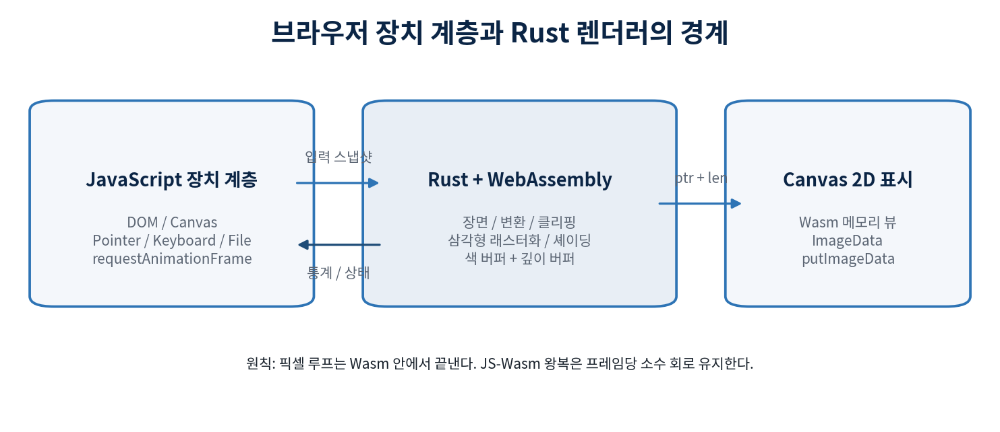
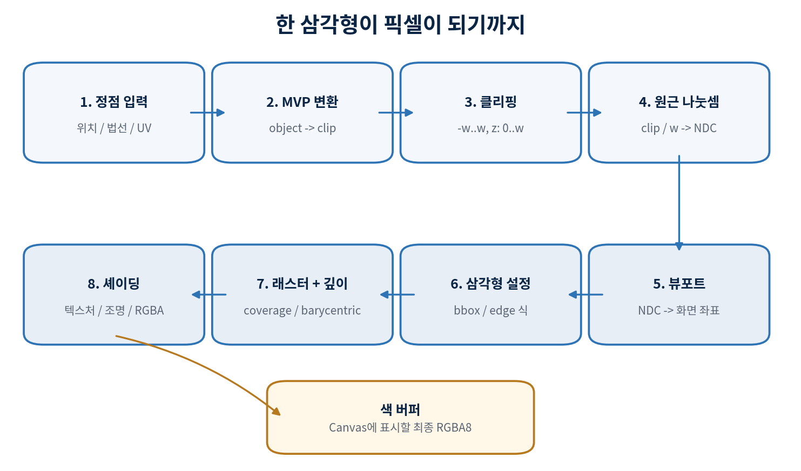

**CURRICULUM + IMPLEMENTATION GUIDE**

# CPU로 만드는 소프트웨어 래스터라이저

_웹(JavaScript) + WebAssembly(Rust) 25장 교육과정 설계서_

전체 소스를 따라 치지 않고, 원리와 알고리즘을 이해한 뒤
코딩 에이전트에게 정확한 구현 계약을 전달하는 과정

**대상: JS와 Rust 기본 문법을 아는 개발자  |  선수 그래픽스 지식 불필요**

v1.0  |  2026-08-22

## 목차

- [0장 · 제목과 과정 안내](00-들어가며.md)
- **1부 · 픽셀, 메모리, 최소 수학**
  - [1장. 소프트웨어 래스터라이저가 하는 일](01-소프트웨어-래스터라이저가-하는-일.md)
  - [2장. Rust-Wasm 프로젝트와 역할 경계](02-rust-wasm-프로젝트와-역할-경계.md)
  - [3장. 프레임버퍼, 색, Canvas 표시](03-프레임버퍼-색-canvas-표시.md)
  - [4장. 픽셀 좌표와 선 그리기](04-픽셀-좌표와-선-그리기.md)
  - [5장. 벡터와 행렬을 필요한 만큼만](05-벡터와-행렬을-필요한-만큼만.md)
- **2부 · 3D 변환과 가시성**
  - [6장. 좌표 공간과 MVP 변환](06-좌표-공간과-mvp-변환.md)
  - [7장. 카메라, 원근 투영, 동차좌표 w](07-카메라-원근-투영-동차좌표-w.md)
  - [8장. Mesh, 인덱스, 정점 속성](08-mesh-인덱스-정점-속성.md)
  - [9장. Winding, 퇴화 삼각형, Backface Culling](09-winding-퇴화-삼각형-backface-culling.md)
  - [10장. 동차 Clip 공간에서 삼각형 자르기](10-동차-clip-공간에서-삼각형-자르기.md)
- **3부 · 삼각형 래스터라이저의 핵심**
  - [11장. Edge 함수, 픽셀 중심, Top-left 규칙](11-edge-함수-픽셀-중심-top-left-규칙.md)
  - [12장. Barycentric 좌표와 속성 보간](12-barycentric-좌표와-속성-보간.md)
  - [13장. 깊이 버퍼와 가려짐](13-깊이-버퍼와-가려짐.md)
  - [14장. Perspective-correct 보간](14-perspective-correct-보간.md)
  - [15장. 파이프라인 조립과 컬러 3D 큐브](15-파이프라인-조립과-컬러-3d-큐브.md)
- **4부 · 텍스처, 조명, 실제 입력**
  - [16장. 웹 이미지 입력과 Texture 메모리](16-웹-이미지-입력과-texture-메모리.md)
  - [17장. UV 주소화, Nearest, Bilinear 샘플링](17-uv-주소화-nearest-bilinear-샘플링.md)
  - [18장. 법선 변환과 Lambert 조명](18-법선-변환과-lambert-조명.md)
  - [19장. Blinn-Phong과 sRGB/Linear 색 공간](19-blinn-phong과-srgb-linear-색-공간.md)
  - [20장. 마우스/키보드와 Orbit/Fly 카메라](20-마우스-키보드와-orbit-fly-카메라.md)
- **5부 · 에셋, 품질, 검증, 성능**
  - [21장. 외부 모델 로딩: OBJ 기준선과 glTF 확장](21-외부-모델-로딩-obj-기준선과-gltf-확장.md)
  - [22장. 투명도, Alpha Test, Blending 순서](22-투명도-alpha-test-blending-순서.md)
  - [23장. Antialiasing과 Mipmap](23-antialiasing과-mipmap.md)
  - [24장. 디버그 뷰, 테스트, 프로파일링](24-디버그-뷰-테스트-프로파일링.md)
  - [25장. 타일링, Worker, SIMD와 최종 Capstone](25-타일링-worker-simd와-최종-capstone.md)
- **부록**
  - [부록 A. 코딩 에이전트와 장별로 일하는 방법](appendix-a-코딩-에이전트와-장별로-일하는-방법.md)
  - [부록 B. 최소 공개 계약과 데이터 구조](appendix-b-최소-공개-계약과-데이터-구조.md)
  - [부록 C. 수학과 알고리즘 빠른 참조](appendix-c-수학과-알고리즘-빠른-참조.md)
  - [부록 D. 화면 증상으로 찾는 오류 단계](appendix-d-화면-증상으로-찾는-오류-단계.md)
  - [부록 E. 최종 Capstone 평가표](appendix-e-최종-capstone-평가표.md)
  - [부록 F. 공식 참고자료](appendix-f-공식-참고자료.md)

## 과정 설계 한눈에 보기

> **최종 결과**  WebGL이나 WebGPU를 사용하지 않고, Rust/Wasm이 만든 RGBA 프레임버퍼를 Canvas 2D로 표시한다. 완성본은 클리핑, 깊이, 원근 보정 UV, 텍스처, 조명, 마우스/키보드 카메라, 디버그 뷰를 갖춘다.

이 과정은 **완성 코드를 베끼는 교재가 아니다.** 학습자는 좌표계, 수식, 불변조건과 테스트를 이해하고 결정한다. 코딩 에이전트는 그 계약에 맞춰 구현한다. 장마다 화면에 보이는 산출물이 생기므로, 수학이나 구조가 틀리면 즉시 발견할 수 있다.

| **구간** | **장** | **핵심 질문** | **통과 산출물** |
| --- | --- | --- | --- |
| 1부 | 1-5장 | 픽셀과 메모리 | Canvas에 Wasm 프레임버퍼, 선/그리드 디버그 |
| 2부 | 6-10장 | 3D 변환과 가시성 | 카메라로 움직이는 클리핑 전 와이어프레임 |
| 3부 | 11-15장 | 삼각형 래스터 핵심 | 균열 없는 컬러 3D 큐브와 깊이 버퍼 |
| 4부 | 16-20장 | 텍스처/조명/입력 | 텍스처와 조명이 적용된 인터랙티브 모델 |
| 5부 | 21-25장 | 에셋/품질/성능 | 외부 모델, 품질 옵션, 테스트와 성능 보고서 |

### 학습 가정과 범위

- 학습자는 JavaScript와 Rust의 함수, 구조체, 배열/벡터, 모듈 문법을 읽을 수 있다고 가정한다. 선형대수는 장 안에서 필요한 만큼 다시 설명한다.
- 기본 경로는 단일 스레드 scalar 구현이다. worker, SharedArrayBuffer, SIMD는 정확한 기준 구현과 프로파일 결과가 생긴 뒤에만 적용한다.
- 브라우저는 장치 계층이다. DOM, Canvas, 파일/이미지 디코딩, 포인터/키보드 이벤트, 프레임 스케줄링은 JS가 담당한다. 픽셀 생성은 Wasm이 담당한다.
- 좌표는 열벡터와 왼손 object/world/view 공간을 사용한다. `+X`는 오른쪽, `+Y`는 위, `+Z`는 전방이며 view 카메라도 `+Z`를 본다. NDC 깊이는 `0..1`, 화면은 y-down이다. 세부 수식은 5-7장과 `doc/decisions/coordinates.md`에서 고정한다.
- 초기 모델은 코드로 만든 큐브다. 외부 에셋은 21장에서 추가한다. OBJ는 교육용 기준선, glTF 2.0은 실전 확장선으로 구분한다.
- 성능 숫자는 기기마다 다르므로 절대 FPS보다 프레임 단계별 p50/p95 시간, 삼각형 수, 해상도, 빌드 모드를 함께 기록한다.

### 권장 저장소 구조

```text
soft-rasterizer/
  renderer-core/          # DOM을 모르는 순수 Rust 라이브러리
    src/math.rs
    src/framebuffer.rs
    src/mesh.rs
    src/clip.rs
    src/raster.rs
    src/texture.rs
    src/lighting.rs
    src/pipeline.rs
  renderer-wasm/          # wasm-bindgen용 얇은 어댑터
    src/lib.rs
  web/                    # Canvas, 입력, 파일, rAF, 표시
    index.html
    main.js
    input.js
    present.js
  tests/                  # 골든 이미지와 브라우저 통합 검사
  doc/decisions/          # 행렬/좌표/깊이 규약 기록
```

> **핵심 구조 결정**  renderer-core는 네이티브 cargo test가 가능해야 한다. 브라우저 API를 core에 넣지 않으면 수학과 래스터 알고리즘을 빠르고 결정적으로 검사할 수 있다.

## 전체 아키텍처와 구현 계약



_그림 1. JS는 장치와 프레임 스케줄링, Wasm은 픽셀 생성 전체를 담당한다._

### 프레임당 호출 계약

1. JS가 requestAnimationFrame(timestamp)의 시간을 받아 dt를 계산하고 지나치게 큰 값은 제한한다.
1. 그 프레임 동안 모인 키/포인터 상태를 하나의 InputSnapshot으로 압축해 Wasm에 넘긴다.
1. Wasm은 update_and_render(dt, input) 한 번 안에서 카메라 갱신부터 모든 픽셀 쓰기까지 끝낸다.
1. JS는 framebuffer_ptr, framebuffer_len, width, height를 읽고 Wasm 메모리에 Uint8ClampedArray 뷰를 만든다.
1. ImageData를 만들고 putImageData로 Canvas에 표시한다. resize나 memory growth가 있었다면 뷰를 반드시 다시 만든다.

```text
boot:
  wasm_exports = await init()
  renderer = new Renderer(internal_width, internal_height)

each animation frame(timestamp):
  dt = clamp((timestamp - previous) / 1000, 0, 0.1)
  input = input_collector.snapshot_and_reset_deltas()
  renderer.update_and_render(dt, input)
  if wasm_memory.buffer or framebuffer pointer changed:
      rebuild Uint8ClampedArray view
  canvas_2d.putImageData(ImageData(view, width, height), 0, 0)
```

### 초기 공개 API의 모양

- Renderer::new(width, height) - 색/깊이 버퍼를 한 번 할당하고 초기 장면을 만든다.
- resize(width, height) - 곱셈 overflow와 최대 픽셀 수를 확인한 뒤 버퍼를 재할당한다.
- update_and_render(dt, input) - 프레임 단위의 유일한 고수준 호출이다.
- framebuffer_ptr() / framebuffer_len() - 소유권을 넘기지 않고 JS가 읽을 메모리 범위만 노출한다.
- upload_texture_rgba(width, height, bytes) / load_mesh(bytes, format) - 장치에서 읽은 바이트를 Rust 내부 표현으로 복사/검증한다.
- stats() - 프레임 시간, 입력/클리핑/래스터된 삼각형 수, 그려진 샘플 수를 작은 구조로 반환한다.

> **경계의 비용**  픽셀마다 JS 함수를 호출하거나 JS 객체를 넘기면 Wasm의 장점이 사라진다. 큰 연속 메모리와 프레임 단위 호출을 기본 단위로 삼는다.



_그림 2. 각 장은 이 파이프라인의 한 단계만 추가하고 다음 장에서 조립한다._

**PART 1**

## 픽셀, 메모리, 최소 수학

브라우저가 제공하는 화면에 Rust가 만든 바이트를 올리고, 이후 모든 장의 기준이 될 좌표와 수학 규약을 고정한다.
