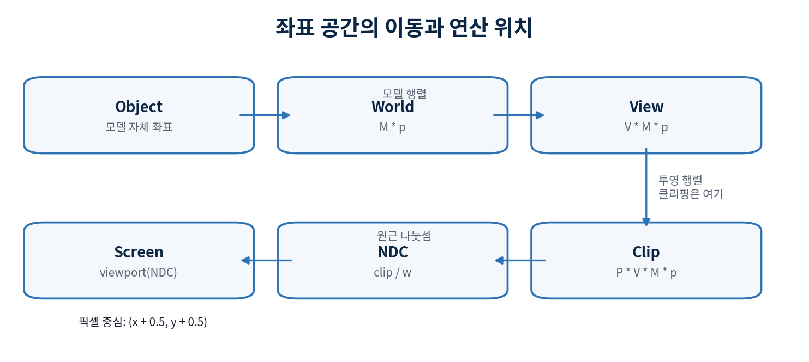

# 6장. 좌표 공간과 MVP 변환

> **PART 2 · 3D 변환과 가시성**
>
> 정점을 여러 좌표 공간으로 옮기고, 카메라 밖 기하를 안전하게 제거한 뒤 화면 좌표까지 도달한다.

> _한 정점의 숫자는 같아 보여도 어느 공간의 숫자인지에 따라 의미가 다르다. 타입 또는 이름으로 공간을 드러내는 것이 가장 좋은 디버깅 도구다._

> **이번 장의 눈에 보이는 결과**  회전하는 큐브의 정점을 Object, World, View, Clip 단계별로 관찰하고, 화면에 투영 전 좌표 통계를 출력한다.

## 왜 필요한가

모델 정점은 모델 제작자가 정한 좌표에 있다. 장면에 배치하려면 world 공간으로, 카메라 기준으로 보려면 view 공간으로, 카메라의 시야 부피를 표준 상자로 바꾸려면 clip 공간으로 이동한다. 이 단계를 한 행렬로 합칠 수 있지만 처음부터 합치면 오류가 난 공간을 찾기 어렵다.

좌표 공간을 구분하면 법선, 광원, 카메라 방향도 올바른 공간에서 dot할 수 있다. 서로 다른 공간의 벡터를 dot하는 코드는 문법적으로는 동작하지만 결과는 의미가 없다.

## 배경지식

- <strong>Object space</strong>: mesh 파일에 저장된 로컬 위치다. 여러 인스턴스가 같은 mesh를 공유할 수 있다.
- <strong>World space</strong>: 모델 행렬 M으로 장면에 배치한 위치다. 광원과 다른 오브젝트를 함께 표현하기 좋다.
- <strong>View space</strong>: 왼손 좌표계에서 카메라가 원점에 있고 +Z를 보는 좌표다. 카메라의 반대 변환을 적용한 결과다. 카메라 앞의 유한한 점은 양의 view z를 가진다.
- <strong>Clip space</strong>: projection을 적용했지만 아직 w로 나누지 않은 Vec4다. 시야 부피는 -w &lt;= x &lt;= w, -w &lt;= y &lt;= w, 0 &lt;= z &lt;= w로 표현한다.
- <strong>NDC와 Screen</strong>: clip/w로 NDC를 만들고, viewport가 이를 화면 픽셀 경계 0..width, 0..height로 옮긴다.

## 핵심 식과 불변조건

```text
p_object_h = Vec4(p_object, 1)
p_world = M * p_object_h
p_view = V * p_world
p_clip = P * p_view = (P * V * M) * p_object_h
이 교재의 clip 규약: -w <= x <= w, -w <= y <= w, 0 <= z <= w
```

## 한 정점을 clip 좌표까지 따라가기

현재 model 합성은 `M=T*Rz*Ry*Rx*S`다. 점에는 scale→X회전→Y회전→Z회전→translation 순으로 작용한다. 원래 Vec3 위치에는 w=1을 붙여 `p_object_h=Vec4(x,y,z,1)`로 만든다.

아래 예제는 회전과 scale을 생략하고 이동만 사용한다.

```text
object = (1,0,0,1)
M = translation(0,0,2)
world = M*object = (1,0,2,1)

eye=(0,0,-3), target=(0,0,0)
view = V*world = (1,0,5,1)

fov_y=90°, aspect=1, near=1, far=10
clip = P*view = (1,0,(10/9)*5-10/9,5)
     = (1,0,40/9,5)
```

카메라가 z=-3에 있으므로 world z=2는 카메라에서 전방 5만큼 떨어져 있다. `p_clip=(P*V*M)*p_object_h`로 한 번에 곱해도 같은 값이어야 한다. 아직 clip xyz를 화면 좌표로 사용하지 않는다. 7장의 divide와 viewport를 적용하면 NDC=(1/5,0,8/9), 600×600 viewport에서 screen=(360,300), 깊이=8/9가 된다. 실제 삼각형은 divide 전에 10장의 clipping을 먼저 거친다.

## 알고리즘과 구현 순서

1. Transform 구조를 translation, rotation, scale로 두고 매 프레임 model matrix를 구성한다.
1. 카메라 view와 projection을 별도로 계산한 뒤 VP와 MVP를 캐시한다. 모델이 여러 개면 VP는 프레임당 한 번만 계산한다.
1. 각 정점에 M, V, P를 단계별로 적용해 개발 빌드에서 min/max와 NaN 개수를 기록한다.
1. VertexOut에 clip_pos와 이후에 필요한 world_pos, normal, uv, color를 담는다. clip_pos 외 속성은 아직 원근 나눗셈하지 않는다.
1. debug 모드에서 하나의 정점을 선택해 object/world/view/clip 값을 overlay에 표시한다.

```text
for vertex in mesh.vertices:
  object = Vec4(vertex.position, 1)
  world  = M * object
  view   = V * world
  clip   = P * view
  emit ClipVertex(
    clip_pos = clip,
    world_pos = world.xyz,
    normal = pending_normal_transform(vertex.normal),
    uv = vertex.uv,
    color = vertex.color
  )
```



_그림 3. 클리핑은 Clip 공간에서, 원근 나눗셈은 그 뒤에, 픽셀 검사는 Screen 공간에서 한다._

## JS-Wasm 경계

JS는 모델 회전 각도나 UI 슬라이더 값을 보낼 수 있지만, MVP 행렬의 규약과 계산은 Rust core가 소유한다. 이렇게 해야 브라우저 이벤트와 무관한 행렬 테스트가 가능하고, JS와 Rust가 서로 다른 row/column 규약을 쓰는 일을 막을 수 있다.

## 코딩 에이전트 작업 명세

- 공간별 값을 담는 내부 타입 또는 이름 규칙을 만든다. 최소한 object_pos, world_pos, view_pos, clip_pos처럼 변수명으로 공간을 잃지 않는다.
- M, V, P, MVP를 한꺼번에 적용한 결과와 단계별 적용 결과가 epsilon 안에서 같은지 테스트한다.
- selected vertex의 단계별 좌표와 clip plane distance를 개발 overlay에 추가한다.
- NaN/Inf가 발생하면 삼각형을 조용히 그리지 않는 대신 개발 빌드에서 카운터와 원인을 보고한다.

## 검증 기준

- M=V=P=identity이면 clip 위치가 object Vec4와 같아야 한다.
- 모델 translation만 바꿀 때 world와 이후 공간만 변하고 object 값은 그대로여야 한다.
- 한 행렬로 합친 MVP와 순차 M -&gt; V -&gt; P 결과가 동일해야 한다.
- 회전 각도를 2π 늘렸을 때 정점이 원래 위치로 돌아오는지 검사한다.

### 자주 생기는 오류

- clip 공간에서 w를 버리면 가까운 평면을 가로지르는 삼각형을 올바르게 자를 수 없다.
- world 위치와 view 방향을 dot하면 조명이 카메라 이동에 따라 비논리적으로 바뀐다.
- MVP를 프레임마다 정점마다 다시 곱해 만들지 않는다. 행렬 합성은 모델/프레임 단위다.
