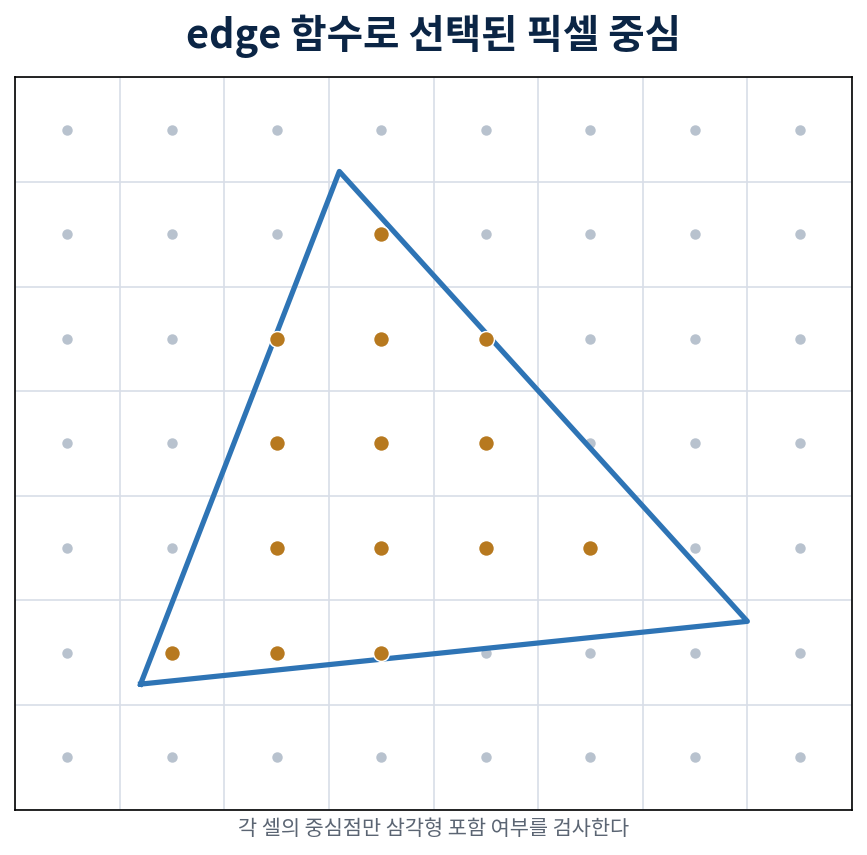

# 11장. Edge 함수, 픽셀 중심, Top-left 규칙

> **PART 3 · 삼각형 래스터라이저의 핵심**
>
> 화면에 도달한 삼각형을 균열 없이 픽셀 샘플로 바꾸고, 속성과 깊이를 올바르게 보간한다.

> _삼각형 채우기의 핵심은 scanline이 아니라 세 변에 대해 픽셀 중심이 어느 쪽에 있는지 묻는 것이다._

> **이번 장의 눈에 보이는 결과**  임의의 두 삼각형으로 만든 사각형이 공유 변에서 구멍도 중복 소유도 없이 정확히 한 번씩 칠해진다.

## 왜 필요한가

bounding box의 모든 픽셀 중심에 대해 세 edge 함수의 부호를 검사하면 삼각형 내부를 결정할 수 있다. 같은 edge 값은 barycentric 좌표로도 사용되므로 coverage와 보간이 하나의 수학으로 연결된다.

단순히 E&gt;=0을 모든 변에 적용하면 공유 변 위의 샘플을 두 삼각형이 모두 그릴 수 있다. 반대로 모두 엄격한 E&gt;0이면 둘 다 그리지 않아 균열이 생긴다. top-left 규칙은 공유 변을 정확히 한쪽 삼각형만 소유하게 한다.

## 배경지식

- <strong>orient2d/edge 함수</strong>는 방향 있는 선 a-&gt;b와 점 p의 상대 위치를 signed area로 나타낸다.
- <strong>positive winding</strong>: 9장에서 정한 screen y-down의 area&gt;0 삼각형만 입력으로 받는다.
- <strong>픽셀 중심</strong>은 (x+0.5, y+0.5)다. 정수 좌표를 픽셀 중심으로 간주하는 다른 API 규약과 섞지 않는다.
- <strong>고정소수점 화면 좌표</strong>는 변 위의 equality를 결정적으로 만든다. 예를 들어 subpixel scale S=256으로 screen 실수를 round(x\*S)해 i64 edge 연산에 쓴다.
- <strong>top-left edge</strong>: 이 교재의 y-down, positive winding에서는 dy&lt;0인 위로 향하는 변 또는 dy=0이고 dx&gt;0인 왼쪽-&gt;오른쪽 수평 변을 포함 변으로 둔다.

## 핵심 식과 불변조건

```text
E(a,b,p) = (b.x-a.x)*(p.y-a.y) - (b.y-a.y)*(p.x-a.x)
area2 = E(v0,v1,v2) > 0
inside edge(a,b): E>0 or (E==0 and top_left(a,b))
top_left(a,b) iff dy<0 or (dy==0 and dx>0), screen y-down 규약
E(x+1,y) = E(x,y) - dy*S,  E(x,y+1) = E(x,y) + dx*S
```

## 알고리즘과 구현 순서

1. screen 위치를 S=256 같은 subpixel fixed-point i64로 양자화한다. 양자화 뒤 area를 다시 계산해 0이면 버린다.
1. 세 정점의 min/max로 pixel bounding box를 구한다. 픽셀 중심 기준 ceil/floor를 사용하거나 보수적으로 넓게 잡고 화면 범위 0..W-1, 0..H-1로 clamp한다.
1. bounding box 첫 픽셀 중심에서 세 edge 값을 계산한다. 각 edge의 top-left 여부도 한 번 계산한다.
1. 행 안에서 x가 1 증가할 때 edge에 -dy\*S를 더한다. 다음 행은 시작 edge에 dx\*S를 더한다.
1. 세 edge가 모두 포함 조건을 만족할 때만 픽셀을 덮였다고 표시한다. 우선 triangle ID 또는 단색을 쓰고 보간은 다음 장에서 추가한다.

```text
setup triangle in fixed-point screen coordinates:
  area = E(v0, v1, v2)
  require area > 0
  edges = [(v1,v2), (v2,v0), (v0,v1)]
  inclusive[i] = is_top_left(edges[i])
  bbox = clamp(pixel_center_bbox(v0,v1,v2), screen)

for y in bbox:
  e0,e1,e2 = edge_values_at(x_min+0.5, y+0.5)
  for x in bbox:
    covered = accept(e0,inclusive0)
           and accept(e1,inclusive1)
           and accept(e2,inclusive2)
    if covered: write_triangle_id(x,y)
    e[i] += -dy[i] * S
  row_start[i] += dx[i] * S
```



_그림 4. 셀 전체가 아니라 중앙 샘플을 검사한다. MSAA에서는 셀 안에 여러 샘플을 둔다._

## JS-Wasm 경계

coverage loop와 고정소수점 변환은 Rust 내부 hot path다. JS는 debug scene의 정점 위치나 top-left 표시 옵션만 바꾼다. Canvas 2D가 삼각형을 채우게 해 결과를 대신 만들면 안 된다.

구현은 9장의 float `orient2d`를 culling과 조기 invalid/degenerate 분류에만 사용하고, 제출 순서를 positive winding으로 정규화한 뒤 S=256 고정소수점 area를 다시 계산한다. 양자화 뒤 `area==0`은 degenerate, 음수나 산술 범위 오류는 pipeline invalid로 분류한다. 이 setup을 통과한 삼각형은 `rasterized_triangles`, 단색을 기록한 sample은 `shaded_samples`에 집계한다. 색 보간은 12장 범위이므로 현재 단색은 제출된 첫 정점의 debug color다.

정상 clip/viewport 출력은 화면 `0..=width`, `0..=height` 안에 있고 RenderTarget은 `width*height <= 16,777,216`이다. 따라서 S=256일 때 각 edge 교차항은 최대 `width*height*S^2 = 1,099,511,627,776`으로 i64 범위에 안전하다. 순수 setup API가 받는 더 넓은 입력은 i128로 area, edge step과 clamp된 bbox 네 모서리를 preflight한 뒤 i64로 좁히며, 범위를 벗어나면 framebuffer를 건드리지 않고 명시적 오류로 거부한다.

## 코딩 에이전트 작업 명세

- orient2d, fixed-point quantize, top-left 분류, bounding box, incremental edge setup을 작은 순수 함수로 나눈다.
- edge 계산은 i64를 사용하고 허용 최대 내부 해상도에서 곱이 범위를 넘지 않는지 문서화한다.
- 두 삼각형으로 만든 여러 방향의 quad fixture에 픽셀 owner count 버퍼를 추가한다.
- naive per-pixel edge 재계산 버전을 테스트 oracle로 남기고 incremental 결과와 비교한다.

## 검증 기준

- positive winding 삼각형의 내부 픽셀은 세 edge가 모두 양수 또는 허용된 0이어야 한다.
- quad 내부 각 샘플의 owner count가 정확히 1이고 공유 대각선에서 0이나 2가 없어야 한다.
- 정점 순서, 수평 top/bottom edge, 세로/대각 edge, 화면 경계에 걸친 삼각형을 각각 검사한다.
- incremental edge 값이 임의 픽셀에서 직접 orient2d로 계산한 값과 정확히 같아야 한다.
- bounding box 밖 색 버퍼가 바뀌지 않아야 한다.

### 자주 생기는 오류

- float edge 값에 임의 epsilon을 넣어 top-left를 흉내 내면 공유 변 소유가 프레임마다 달라질 수 있다. equality가 중요한 setup에는 fixed-point를 쓴다.
- y-up 문서의 top-left 식을 그대로 복사하면 포함 변이 반대가 된다. 이 교재의 y-down 식과 quad 테스트를 함께 사용한다.
- bounding box를 화면에 clamp하지 않거나 음수를 usize로 바꾸면 매우 큰 인덱스가 된다.
