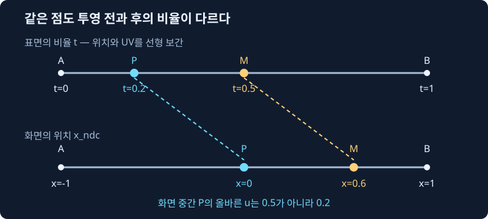

# 14장. Perspective-correct 보간

> **이번 장의 결과** 기울어진 사각형을 두 삼각형으로 나눠 그린다. affine 모드에서는 공유 대각선에서 체크무늬가 꺾이거나 간격이 어긋나고, perspective-correct 모드에서는 같은 평면의 무늬가 이어진다.

이번 장에서는 이미지 파일 대신 복원한 UV로 procedural checker를 그린다. 이미지 업로드와 sampler는 16–17장에서 연결한다. Rust가 픽셀을 만들고 Canvas는 완성된 프레임버퍼만 표시한다.

## 먼저 구분할 두 가지 비율

12장에서 배운 barycentric `λ`는 **화면에서의 비율**이다. 예를 들어 화면에 그린 선분의 정중앙은 양 끝을 50%씩 섞은 위치다. 그런데 원근 투영은 먼 곳을 작게 보이게 한다. 그래서 화면에서 50%인 지점이 3D 표면에서도 50%라는 보장은 없다.

UV의 `u`는 화면 위치가 아니라 표면에 붙인 좌표다. 삼각형의 표면을 따라 선형으로 변해야 하는 UV를 화면 비율로 바로 섞으면 다른 지점의 UV를 가져오게 된다. 이것이 affine 보간의 왜곡이다. 한 삼각형 안에서 선이 곡선으로 휘는 것은 아니며, 두 삼각형이 만나는 대각선에서 방향이나 간격의 불연속이 드러날 수 있다.

`perspective correction`은 화면에서 찾은 픽셀에 해당하는 **표면의 비율을 되찾는 계산**이다. 아래에서는 한 변으로 먼저 이해하고, 같은 원리를 세 정점으로 확장한다.

## 1. 화면 중간이 표면 중간이 아닌 숫자 예제

7장의 투영에서 세로 시야각 90°, aspect=1을 고르면 `x_clip=x_view`, `w_clip=z_view`다. y는 모두 0으로 두자. 3D 선분의 가까운 끝 A와 먼 끝 B에 다음 값을 붙인다.

| 값 | A | B |
| --- | ---: | ---: |
| view 좌표 `(x,z)` | `(-1,1)` | `(4,4)` |
| `w_clip` | `1` | `4` |
| 투영 위치 `x_ndc=x/w` | `-1` | `1` |
| 표면 좌표 `u` | `0` | `1` |

NDC에서 -1과 1의 중간은 0이다. viewport 변환은 선형이므로 NDC 중간은 화면에서도 중간이다. 이때 화면 가중치는 `λA=1/2`, `λB=1/2`다. UV도 그대로 섞는 affine 계산은 다음과 같다.

```text
u_affine = (1/2)*0 + (1/2)*1 = 1/2 = 0.5
```

이 답이 맞는지 **실제 표면의 점을 투영해서** 확인하자. 표면에서 A부터 B까지 간 비율을 `t`라 하자. A는 t=0, B는 t=1이다. 선형 보간 `lerp(A,B,t)=(1-t)A+tB`를 위치에 적용하면:

```text
x_view(t) = (1-t)*(-1) + t*4 = -1 + 5t
z_view(t) = (1-t)*1    + t*4 =  1 + 3t

x_ndc(t) = x_view(t)/z_view(t)
         = (-1+5t)/(1+3t)
```

우리가 찾는 화면 중간은 `x_ndc=0`이다. 이 선분의 z는 양수이므로 분모는 0이 아니다. 따라서 분자가 0이면 된다.

```text
-1 + 5t = 0
5t = 1
t = 1/5 = 0.2

u(t) = (1-t)*0 + t*1 = 0.2
```

즉 화면의 정중앙은 표면에서는 A에서 **20% 이동한 곳**이다. 정답은 0.2이며 affine의 0.5는 다른 곳의 UV다. 거꾸로 표면 중간 t=0.5를 투영해도 확인할 수 있다.

```text
x_view = -1 + 5*0.5 = 1.5
z_view =  1 + 3*0.5 = 2.5
x_ndc  = 1.5/2.5 = 0.6     # 화면 중간 0보다 오른쪽
```

## 2. 같은 답을 1/w로 구하기



위 그림의 P는 방금 구한 t=0.2, M은 표면 중간 t=0.5다. 점을 새로 만든 것이 아니라 **같은 점의 투영 전·후 위치**를 두 줄로 나란히 비교했다.

픽셀마다 표면의 방정식을 새로 풀 필요는 없다. 정점에서 두 값을 준비하면 된다.

- `inv_w=1/w`: 나눗셈에 사용할 역수.
- `u_over_w=u/w`: u를 같은 w로 나눈 값.

두 값을 **화면 가중치 λ로 각각** 보간한다. 여기서 `q`는 u가 아니라 보간된 `1/w`다.

```text
q = λA/wA + λB/wB
  = (1/2)/1 + (1/2)/4
  = 1/2 + 1/8 = 5/8

u_num = λA*uA/wA + λB*uB/wB
      = (1/2)*0/1 + (1/2)*1/4
      = 1/8

u = u_num/q
  = (1/8)/(5/8)
  = 1/5 = 0.2
```

직접 투영으로 찾은 답과 같다. `u_num=0.125` 자체가 최종 u는 아니다. 마지막에 q로 나누는 단계까지 있어야 표면의 값을 복원한다.

## 3. 왜 이 공식이 성립하는가

이제 삼각형의 세 정점으로 확장하자. `Σ`는 아래에서 `i=0,1,2` 세 항을 모두 더한다는 뜻이다. 기호를 먼저 구분한다.

| 기호 | 뜻 |
| --- | --- |
| `Hi=(xi,yi,zi,wi)` | 정점 i의 clip 좌표 |
| `βi` | 투영 전 표면의 barycentric 가중치, 합은 1 |
| `λi` | 투영 후 화면의 barycentric 가중치, 합은 1 |
| `a_i` | 정점의 일반 속성. u, v, color, normal의 성분 등 |

M/V/P는 동차좌표에서 선형 변환이다. 따라서 표면 가중치 β로 선택한 점의 clip 좌표와 w는 다음과 같다.

```text
H = Σ βi*Hi
w = Σ βi*wi
```

그 점의 x를 perspective divide하고, 각 항에 wi를 곱했다가 나눠서 정점의 투영 위치 `xi/wi`를 드러내자.

```text
x_ndc = (Σ βi*xi)/w
      = Σ (βi*wi/w)*(xi/wi)
```

y에도 같은 식이 성립한다. 오른쪽은 투영된 정점들을 `βi*wi/w`라는 비율로 섞은 식이다. 이 비율들의 합은 `Σβi*wi/w=w/w=1`이다. 따라서 이것이 화면 가중치다.

```text
λi = βi*wi/w
```

찾고 싶은 것은 β이므로 정리한다.

```text
βi = λi*w/wi

Σβi = 1이므로:
w * Σ(λi/wi) = 1

q = Σ(λi/wi)라 정의하면:
w = 1/q
βi = (λi/wi)/q
```

일반 속성 a는 표면에서 `a=Σβi*a_i`로 선형 보간된다. 방금 구한 β를 넣으면 최종식이 나온다.

```text
a = Σ[(λi/wi)/q]*a_i
  = [Σ λi*a_i/wi] / q
  = [Σ λi*a_i/wi] / [Σ λi/wi]
```

앞의 선분 예제에서 βA=(1/2)/(5/8)=4/5, βB=(1/8)/(5/8)=1/5다. 화면의 50:50을 표면의 80:20으로 복원한 것이다. 삼각형에서도 세 항을 더할 뿐 원리는 같다.

## 4. UV·색·위치·법선에 적용하기

UV는 성분이 두 개이므로 u와 v의 분자를 각각 구하고 **같은 q**로 나눈다. world position과 RGB에도 성분별로 같은 계산을 적용한다. 각 속성마다 q를 새로 구할 필요는 없다.

```text
uv = (Σ λi*uv_i/wi) / q
world_position = (Σ λi*world_position_i/wi) / q
color = (Σ λi*color_i/wi) / q
normal_raw = (Σ λi*normal_i/wi) / q
normal = normal_raw / length(normal_raw)
```

법선은 방향 벡터다. 예를 들어 `(1,0,0)`과 `(0,1,0)`을 반씩 섞으면 `(0.5,0.5,0)`이고 길이는 `sqrt(0.5)`다. 다시 정규화하면 `(1/√2,1/√2,0)`이 된다. 방향을 복원한 후 길이를 1로 맞춰야 이후 조명의 내적이 올바르다. 길이가 0 또는 비유한 값이면 실패로 처리한다.

## 5. 깊이 z_ndc는 왜 다시 보정하지 않는가

깊이 버퍼에 쓰는 값은 일반 속성 `z_clip` 자체가 아니라 **이미 w로 나눈 `z_ndc=z_clip/w`**다. 그 정의에서 다시 시작하면:

```text
z_ndc = (Σ βi*z_clip_i)/w
      = Σ (βi*wi/w)*(z_clip_i/wi)
      = Σ λi*z_ndc_i
```

앞에서 얻은 `λi=βi*wi/w`가 그대로 나타난다. 그러므로 **정점의 z_ndc를 화면 λ로 affine 보간하면 끝**이다. 이미 나눈 깊이에 일반 속성 복원식을 또 적용하면 중복 보정이다.

같은 A/B 예제에 near=1, far=4를 사용하자. 7장의 깊이식은 다음과 같다.

```text
z_ndc = f/(f-n) - f*n/((f-n)*z_view)
      = 4/3 - 4/(3*z_view)

A: z_view=1 → z_ndc=0
B: z_view=4 → z_ndc=1
화면 중간: (1/2)*0 + (1/2)*1 = 1/2
```

실제 표면점 t=1/5의 view 깊이는 `1+3/5=8/5`였다. 이를 직접 투영하면:

```text
4/3 - 4/(3*(8/5))
= 4/3 - 5/6
= 1/2
```

두 결과가 일치한다. 반면 z_ndc를 u처럼 다시 보정하면 앞 예제와 똑같이 1/5가 나와 틀린 깊이가 된다. **view z를 일반 속성으로 복원하는 것**과 **버퍼에 기록할 z_ndc를 보간하는 것**을 구분해야 한다.

## 6. clipping을 먼저 끝내야 하는 이유

clipping의 교차 비율 t는 clip 공간에서 구한다. 새 정점의 원래 속성과 clip 좌표 전체를 같은 t로 보간한 **후** `1/w`, `a/w`를 만든다. 나눗셈과 선형 보간은 순서를 바꿀 수 없다.

교차점 t=1/2, 양 끝의 `(u,w)`가 `(0,1)`, `(1,3)`이라고 하자.

```text
올바른 순서:
u_new = (0+1)/2 = 1/2
w_new = (1+3)/2 = 2
u_new/w_new = (1/2)/2 = 1/4

먼저 나눠 버린 잘못된 순서:
lerp(uA/wA, uB/wB, 1/2)
= lerp(0, 1/3, 1/2)
= 1/6
```

`1/4`과 `1/6`은 다르다. 따라서 10장의 `ClipVertex`에는 원래 속성을 보관하고, clipping을 끝낸 `ScreenVertex`에서 over-w를 준비한다.

## 구현 순서와 실패 처리

```text
# 정점: clipping 종료 후
inv_w_i = 1 / w_clip_i
attribute_over_w_i = attribute_i * inv_w_i

# 픽셀: coverage를 통과한 후보
z_ndc = Σ λi*z_ndc_i
if not finite(z_ndc) or z_ndc outside [-1e-6, 1+1e-6]:
    reject fragment; increment invalid_depth_samples
z_ndc = clamp(z_ndc, 0, 1)  # 13장의 작은 수치 이탈 처리
if not (z_ndc < stored_depth):
    reject fragment

# 깊이를 통과한 후보만 일반 속성을 복원한다.
q = λ0*inv_w_0 + λ1*inv_w_1 + λ2*inv_w_2
if not finite(q) or q <= 1e-8:
    reject fragment; increment invalid_interpolation_samples

attribute = (Σ λi*attribute_over_w_i) / q
normal = normalize(restored_normal)
# 모든 값이 유효한 뒤 색과 깊이를 commit한다.
```

정상 near clipping을 통과한 정점은 w>0이고 내부 픽셀의 λ는 음수가 아니므로 q도 양수다. 구현의 `q<=1e-8` 검사는 이 조건에 추가한 수치 안전 한계다. 유효하지 않은 fragment는 색이나 깊이를 남기지 않고 오류 통계로 관찰한다.

최신 `ScreenVertex::from_clip_vertex`는 world position/normal/UV/color의 over-w와 affine 비교용 원본을 함께 보관한다. `FragmentInput::from_screen_vertices`는 한 q를 공유한다. JS는 비교 모드를 선택하고 성공/실패 수와 q의 최소·최대만 읽으며 fragment별 배열은 Wasm 경계를 넘기지 않는다.

## 손으로 확인할 불변조건

- 모든 w가 같은 k이면 분자·분모의 1/k가 소거되어 `a=Σλi*a_i`가 된다. 이 경우 affine과 perspective 결과는 같다.
- 정점에서는 해당 λ만 1이므로 `(a_i/w_i)/(1/w_i)=a_i`다. 원래 속성이 복원된다.
- 한 평면 quad에 일관된 표면 UV를 주면 어느 대각선으로 나눠도 같은 UV 함수가 이어져야 한다. 이 저장소는 결정적 fixture의 이미지로 검증한다.
- 모드를 바꿔도 coverage와 깊이 보간 규칙은 같아야 한다. 변하는 것은 일반 속성의 복원 방식이다.
- 위 예제의 화면 중간에서 u=0.2, z_ndc=0.5가 동시에 나와야 한다. 둘을 같은 공식으로 처리하면 안 되는 이유를 숫자로 확인할 수 있다.
