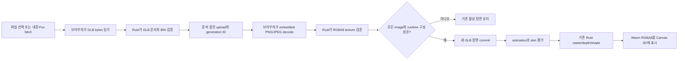
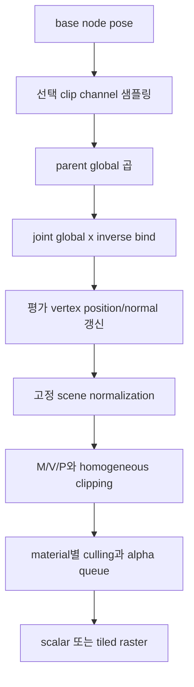

# GLB runtime loading 구현 가이드

- 기준 branch: `main`
- 기준 commit: `fdaec22beab1f8d64fa664c85aa984c7f58ba2c7`
- 문서 범위: 기준 commit 이후 추가한 26장 GLB parse, image decode, scene commit, animation/skinning render 경로

## 요약

사용자가 binary 3D asset을 고르면 브라우저가 파일을 읽고 Rust가 장면 구조와 수치 데이터를 검증한다. asset 안의 PNG/JPEG는 브라우저가 RGBA8로 바꾸지만, mesh와 animation을 해석하고 픽셀을 만드는 일은 Rust가 맡는다.

새 asset을 읽는 동안 현재 화면은 그대로 유지된다. 모든 image와 장면 구성이 성공한 뒤에만 새 장면으로 교체하므로 손상된 파일이나 늦게 끝난 이전 파일 선택이 유효한 화면을 덮지 않는다.

매 frame에는 선택한 animation 시간을 먼저 평가한다. 그 결과로 node와 joint가 움직이고, 변형된 vertex가 기존 clipping, depth, texture, lighting과 Canvas 2D 표시 경로를 그대로 통과한다.

## 이 문서에서 쓰는 말

- **GLB**: glTF 2.0 JSON과 binary buffer, image를 한 파일에 담는 binary container다.
- **준비 중인 upload**: 파일 검증은 끝났지만 image decode와 최종 장면 교체가 아직 끝나지 않은 작업이다.
- **활성 장면**: 현재 frame을 실제로 만드는 cube, OBJ 또는 GLB 장면이다.
- **clip**: 여러 node의 translation, rotation, scale key를 시간축에 묶은 animation 한 개다.
- **skin**: vertex의 joint index/weight와 joint의 inverse bind matrix를 묶은 변형 정보다.

## 전체 흐름

이 그림은 큰 byte 배열과 image가 어느 경계를 건너고, 어느 시점에 활성 장면이 바뀌는지 보여 준다.

GLB bytes는 `prepare` 호출 중 Rust가 필요한 구조와 encoded image를 자기 메모리로 복사한다. JavaScript가 넘긴 `ArrayBuffer`를 Rust pointer로 보관하지 않는다. 반대로 framebuffer는 Rust 소유 메모리의 빌린 view이므로 memory growth나 resize 뒤에는 브라우저가 view를 다시 만든다.

## 파일 선택과 시작 장면

제품 build는 `new URL("./assets/Fox.glb", import.meta.url)`로 vendored asset을 가져온다. Fox를 commit한 뒤 `Walk` clip을 선택하고 반복 재생한다. fetch, parse 또는 image decode가 실패하면 내장 cube를 계속 표시하고 오류 영역에 다른 `.glb`를 선택할 수 있다는 안내를 남긴다.

화면 아래 attribution에는 Fox model의 PixelMannen/CC0, rig·animation의 tomkranis/CC BY 4.0, conversion의 AsoboStudio·scurest/CC BY 4.0과 pinned upstream 링크를 표시한다. 따라서 정적 배포물에서도 asset credit과 license를 확인할 수 있다. 저장소의 `Fox.NOTICE.md`는 exact commit, byte length와 SHA-256까지 더 엄격하게 고정한다.

test automation build는 시작할 때 cube를 유지한다. 1장부터 25장까지의 golden과 frame 통계를 바꾸지 않기 위한 test-only 시작 조건이다. 26장 E2E는 automation API로 같은 Fox loader를 명시적으로 호출한다.

파일 입력은 이름과 magic을 함께 본다. `.glb`는 최대 32 MiB binary로 읽고, `.obj`는 기존 8 MiB UTF-8 경로를 사용한다. JSON `.gltf`는 외부 buffer와 URI 해석 범위가 생기므로 받지 않는다.

## 준비, decode, commit

### 1. Rust가 파일을 준비한다

`prepare_glb(bytes)`는 GLB header의 magic, version 2와 선언 길이를 먼저 검사한다. 그 뒤 `gltf::Gltf::from_slice_without_validation`으로 container를 읽고, 같은 crate가 공개한 `gltf::json::validation::Validate`로 문서 index와 필수 필드를 검증한다. 이 순서는 지원하지 않는 required extension과 외부 buffer를 importer 오류로 먼저 구분하면서도 `gltf` crate의 구조 검증을 그대로 사용한다. 이 profile은 URI 없는 BIN buffer가 정확히 하나여야 하며, BIN 실제 길이와 모든 bufferView/accessor offset·stride·count 범위를 reader 실행 전에 확인한다. default scene이 없으면 첫 scene을 사용한다.

성공하면 증가하는 ID와 함께 준비 중인 upload가 생긴다. 새 GLB prepare나 OBJ load 시도가 시작되는 즉시 이전 pending GLB를 폐기하므로, 뒤의 새 asset이 실패하더라도 오래된 ID를 다시 commit할 수 없다. 이전 image decode가 늦게 끝나도 ID가 맞지 않아 RGBA나 commit을 공급할 수 없다.

브라우저도 파일 선택 generation을 별도로 가진다. 새 선택이 시작되면 Rust의 이전 pending ID를 취소하고, 늦게 끝난 fetch/read/decode 결과는 UI 상태까지 갱신하지 않는다. 이 이중 확인은 느린 GLB가 뒤에 선택한 OBJ나 GLB를 덮는 비동기 경합을 막는다.

### 2. 브라우저가 image만 decode한다

Rust는 image bufferView의 encoded bytes와 MIME type을 작은 getter로 돌려준다. 같은 encoded view를 여러 image가 참조해도 복사 메모리가 입력보다 임의로 증폭되지 않도록 전체 encoded image byte 합을 32 MiB로 제한한다. JavaScript는 이를 `Blob`으로 감싸 `createImageBitmap`과 임시 Canvas 2D를 통해 top-to-bottom RGBA8로 바꾼다.

decode한 width, height와 byte 길이는 Rust `Texture::from_rgba8`가 다시 확인한다. base와 전체 mip chain을 pending GLB의 모든 image에 걸쳐 합산한 texel 수가 16,777,216을 넘으면 이 단계에서 실패한다. 같은 image slot을 다시 공급할 때는 이전 mip texel 수를 빼므로 검사 자체가 불필요한 누적을 만들지 않는다.

### 3. Rust가 한 번에 활성화한다

모든 image slot이 채워지면 texture ID를 먼저 예약한다. 장면 bounds, node 계층, joint normal matrix까지 runtime을 구성할 수 있는지 확인한 뒤 검증된 texture 묶음과 새 장면을 활성 상태에 넣는다.

commit 전에는 GLB 전용 `TextureStore`와 활성 장면을 바꾸지 않는다. 따라서 image 하나가 실패하거나 runtime bounds가 퇴화해도 이전 장면과 texture ID는 그대로다. 성공한 commit은 새 store를 한 번에 교체해 이전 GLB texture를 회수한다.

## scene과 primitive가 frame으로 바뀌는 과정

GLB runtime은 node, skin, animation clip, material과 draw primitive 목록을 소유한다. primitive는 immutable index/기본 vertex와 frame마다 재사용하는 평가 vertex를 함께 가진다.

unskinned primitive는 node global matrix를 position에 곱한다. global matrix의 determinant가 음수면 triangle submit winding도 뒤집어 반사 변환 뒤의 면 방향을 보존한다. skinned primitive는 glTF 규약에 따라 mesh node transform을 무시하고 joint palette만 적용하므로 mesh node의 음수 scale로 winding을 뒤집지 않는다. inverse bind matrix는 유한한 affine 행렬이어야 하며, 이 장은 joint palette에 음수 determinant가 생기는 pose를 지원하지 않고 오류로 거부한다. normal은 각 affine matrix의 inverse-transpose 3×3으로 변환한 뒤 weight 합을 정규화한다. `doubleSided` 뒷면은 fragment lighting 직전에 보간 normal을 뒤집는다.

장면 normalization은 처음 평가한 pose의 전체 bounds에서 한 번 만든다. frame마다 bounds를 다시 계산하지 않기 때문에 달리는 Fox의 다리나 꼬리가 움직여도 화면 배율이 흔들리지 않는다.

## animation 시간 규칙

clip 변경은 시간을 0으로 되돌리고 재생을 시작한다. seek는 재생/일시정지 여부를 바꾸지 않는다.

- 반복 켬: `next_time.rem_euclid(duration)`
- 반복 끔: duration에서 멈추고 재생을 종료
- STEP: 직전 key 값
- LINEAR translation/scale: component 선형 보간
- LINEAR rotation: quaternion 최단 경로 slerp
- CUBICSPLINE: key interval을 반영한 Hermite tangent, rotation 결과 정규화

`dt`는 다른 장면과 같이 frame당 최대 0.1초로 제한된 값을 받는다. public animation runtime도 비유한 `dt`를 직접 거부해 NaN 시간이나 sampling panic을 만들지 않는다. pause 상태에서도 pose를 다시 평가할 수 있으므로 seek 직후 `dt=0` render가 즉시 새 자세를 보여 준다.

node global matrix는 frame마다 재사용하는 명시적 stack과 3-state 방문 배열로 반복 계산한다. 4,096개 node가 한 줄로 이어져도 Rust/Wasm call stack에 재귀 frame을 쌓지 않으며 cycle은 명시적 오류다. clip/seek/update가 음수 determinant joint pose 같은 지원하지 않는 상태를 만들거나, 유한한 TRS의 parent-child 합성·joint palette·world/normalized position이 `f32` 범위를 넘으면 control 상태와 pose/evaluated vertex를 이전 유효 frame으로 재평가해 원자적으로 rollback한다.

## 좌표와 재질 적응

glTF의 오른손 좌표는 importer에서 X 반사로 내부 왼손 좌표로 한 번만 바뀐다. position과 normal은 X 부호를 바꾸고 triangle winding도 맞바꾼다. node와 inverse bind matrix는 `C*M*C`, quaternion은 `(x,-y,-z,w)`를 사용한다.

base color texture는 sRGB image로 보관하고 sampling 전에 linear로 decode한다. `baseColorFactor`는 원래 linear이므로 기존 material 저장 계약에 맞게 importer에서 sRGB로 encode한 뒤 shader에서 다시 linear로 복원한다. alpha는 encode/decode하지 않는다.

GLB가 지정한 alpha mode, cutoff, double-sided와 sampler는 읽기 전용이다. UI의 lighting, shader, normal, light, debug, quality와 texture sampling on/off는 GLB에도 적용한다. commit은 기존 shader/normal/specular와 texture sampling on/off 상태를 새 장면에 다시 적용하므로 core API를 직접 사용해도 설정이 갑자기 기본값으로 돌아가지 않는다. `KHR_materials_unlit` material은 lighting 설정과 관계없이 unlit을 유지한다.

## 지원 표

| 영역 | 지원 | 명시적으로 거부 | 무시 또는 낮춤 |
| --- | --- | --- | --- |
| container | header/asset 2.0, minVersion ≤ 2.0, 단일 BIN, padding ≤ 3 bytes, embedded PNG/JPEG | JSON `.gltf`, 추가 chunk/BIN, URI buffer/image | - |
| topology | indexed/non-indexed TRIANGLES | 다른 primitive mode | - |
| vertex | POSITION, optional NORMAL/UV0/COLOR0, JOINTS0+WEIGHTS0 | sparse accessor, morph, tangent, 추가 UV/joint set | - |
| scene | default/first scene, 여러 node/mesh/primitive | - | glTF camera/light 무시 |
| material | base color, alpha, double-sided, unlit | base texture의 UV0 이외 texcoord | metallic-roughness/normal/occlusion/emissive 무시 |
| sampler | repeat/clamp/mirror, nearest/bilinear, nearest mip | - | min/mag 불일치는 bilinear 하나로 합치고 trilinear 요청은 nearest mip으로 낮춤; 둘 다 통계 기록 |
| animation | TRS STEP/LINEAR/CUBICSPLINE | morph weight, 한 clip의 중복 node/property target, 비유한 dt | blending/cross-fade는 runtime 기능 없음 |
| skin | 4-weight linear blend, 유한 affine inverse bind | joint/weight 추가 set, 음수 determinant joint pose | dual quaternion은 runtime 기능 없음 |

## 실패와 관찰 가능성

parse와 browser image decode 실패는 GLB upload failure count를 늘리고 마지막 원인을 GLB status에 남긴다. frame animation 평가 실패는 upload count와 분리된 runtime error로 최대 512자를 남기고 재생을 일시정지해 같은 실패 시간을 매 frame 다시 넘지 않는다. seek/clip UI도 rollback된 실제 시간과 선택값으로 즉시 복원한다. document validation은 처음 8개 오류를 각각 256자로 제한해 보여 주고 전체 오류 수를 덧붙인다. 새 파일 generation에 의해 취소된 stale upload는 실패가 아니다. 성공한 frame은 draw item, vertex, triangle, 선택 clip이 실제로 대상으로 삼는 고유 node, primitive별로 실제 만든 joint matrix, skinned vertex와 sampler downgrade 수를 `FrameStats`와 GLB status에 남긴다. UI는 asset 이름과 node/skin/joint/clip 수를 보여 준다.

transparent material은 opaque와 mask가 끝난 뒤 처리한다. 여러 primitive의 transparent triangle을 하나의 scratch 목록에 모아 view `+Z` 큰 값부터 정렬한다. importer는 triangle마다 clipping 후 최대 7개가 생기는 최악치를 합산해 65,536개를 넘는 BLEND 장면을 거부하므로 scratch가 무제한 성장하지 않는다. primitive별 skin joint matrix 합도 frame당 65,536개로 제한한다. node 방문 상태, skin position/normal palette, 평가 vertex와 transparent triangle scratch capacity는 frame 사이에 재사용한다.

## 검증과 남은 간격

직접 회귀 테스트가 있는 동작:

- 메모리에서 만든 indexed/non-indexed GLB parse와 누락 normal 생성
- embedded image, sampler, material, node 계층과 좌표 변환
- STEP, LINEAR, CUBICSPLINE과 loop/clamp/seek
- 2-joint linear blend skinning과 mesh node transform 무시
- stale ID, image 누락, 잘못된 GLB와 browser image decode 실패가 활성 장면을 보존하고 실패 원인을 기록하는지
- GLB pose의 scalar/tiled RGBA와 depth exact match
- 실제 Fox의 26 nodes, 24 joints, 3 clips, 1,728 vertices, 576 triangles
- 1×/2× 내부 pixel hash, pause/seek/Run/loop, memory view 재생성, 화면 attribution과 WebGL/WebGPU 미사용

현재 직접 지원하지 않는 인접 기능은 tangent/normal texture, PBR, morph target, animation blending과 진짜 trilinear filter다. glTF camera도 읽지 않으므로 모든 asset은 기존 Orbit/Fly camera와 고정 scene normalization을 사용한다.

## 구현 연결

| 역할 | 구현 위치 |
| --- | --- |
| GLB parse, 좌표 변환, animation과 skin runtime | `renderer-core/src/glb.rs` |
| staged upload, 활성 장면, frame draw와 통계 | `renderer-core/src/lib.rs` |
| texture/mipmap과 mirrored repeat | `renderer-core/src/texture.rs` |
| Wasm prepare/image/commit와 animation getter/setter | `renderer-wasm/src/lib.rs` |
| 파일 크기, magic, browser image decode orchestration | `web/glb-upload.js` |
| 시작 Fox, 파일 선택, controls와 automation | `web/main.js`, `web/index.html` |
| vendored asset provenance와 무결성 | `web/assets/Fox.NOTICE.md`, `scripts/check_assets.mjs` |
| 실제 브라우저 회귀 | `tests/e2e/chapter26.spec.js` |
